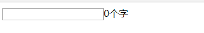

比如我们要实现这样一个组件, 就是在输入框里面字数的计数.


> 使用jQuery作为基础语言库

## 最简陋写法
```html
<!DOCTYPE html>
<html lang="en">
<head>
    <meta charset="UTF-8">
    <meta name="viewport" content="width=device-width, initial-scale=1.0">
    <meta http-equiv="X-UA-Compatible" content="ie=edge">
    <title>demo</title>
    <script src="http://code.jquery.com/jquery-1.9.1.min.js"></script>
</head>
<body>
    <script>
        $(function() {

            var input = $('input');

            // 用来获取字数
            function getNum(){
                return input.val().length;
            };

            // 渲染元素
            function render() {
                var num = getNum();

                // 没有字数的容器就新建一个
                if ($('#count').length === 0) {
                    input.after('<span id="count"></span>');
                };

                $('#count').html(num+'个字');
            };

            // 监听事件
            input.on('keyup',function(){
                render();
            });

            // 初始化，第一次渲染
            render();
        })
    </script>
    <input type="text"/>
</body>
</html>
```
这里估计很多新手都会这样写, 执行起来没有什么问题, 但是各种全局变量, 再加入新的东西的时候就有各种问题, 变量名重复啊等等...
当然这里也可以用自执行函数来处理全局变量, 再想拓展组件各种局部变量也很麻烦.

## 作用于隔离
单个变量模拟命名空间
```html
<!DOCTYPE html>
<html lang="en">
<head>
    <meta charset="UTF-8">
    <meta name="viewport" content="width=device-width, initial-scale=1.0">
    <meta http-equiv="X-UA-Compatible" content="ie=edge">
    <title>demo</title>
    <script src="http://code.jquery.com/jquery-1.9.1.min.js"></script>
</head>
<body>
    <script>
        var textCount = {
            input: null,
            init: function(config) {
                this.input = $(config.id);
                this.bind();
                // 返回this, 实现链式调用
                return this;
            },
            bind: function() {
                var self = this;
                this.input.on('keyup', function() {
                    self.render();
                });
            },
            getNum: function() {
                return this.input.val().length;
            },
            render: function() {
                var num = this.getNum();

                // 没有字数的容器就新建一个
                if ($('#count').length === 0) {
                    this.input.after('<span id="count"></span>');
                };

                $('#count').html(num+'个字');
            }
        };

        $(function() {
            textCount.init({id: 'input'}).render();
        })
    </script>
    <input type="text" id="input" />
</body>
</html>
```
这样改造一番, 立马清晰了很多, 所有功能都在一个变量下面. 代码清晰, 有统一的入口调用.

但是还是有瑕疵, 没有私有的概念, 比如上面的`getNum()`、`bind()`应该都是私有的方法. 但是其它的代码可以随意的改动这些代码. 当代码量特别多时, 很容易出现变量重复或被修改的问题.

于是乎出现下面的写法
## 函数闭包写法
```html
<!DOCTYPE html>
<html lang="en">
<head>
    <meta charset="UTF-8">
    <meta name="viewport" content="width=device-width, initial-scale=1.0">
    <meta http-equiv="X-UA-Compatible" content="ie=edge">
    <title>demo</title>
    <script src="http://code.jquery.com/jquery-1.9.1.min.js"></script>
</head>
<body>
    <script>
        var TextCount = (function() {
            // 私有方法, 外部无法访问
            var _bind = function(that) {
                that.input.on('keyup', function() {
                    that.render();
                });
            };

            var _getNum = function(that) {
                return that.input.val().length;
            };

            var TextCountFun = function(config) {};

            TextCountFun.prototype.init = function(config) {
                this.input = $(config.id);
                _bind(this);

                return this;
            };

            TextCountFun.prototype.render = function() {
                var num = _getNum(this);

                // 没有字数的容器就新建一个
                if ($('#count').length === 0) {
                    this.input.after('<span id="count"></span>');
                };

                $('#count').html(num+'个字');
            };
            
            // 返回构造函数
            return TextCountFun;
        })();

        $(function() {
            new TextCount().init({id: 'input'}).render();
        })
    </script>
    <input type="text" id="input" />
</body>
</html>
```
这种写法, 把所有的东西都包在了一个自动执行的闭包里面, 所以不会受到外面的影响, 并且只对外公开了`TextCountFun`构造函数, 生成的对象只能访问到`init`,`render`方法. 
大部分jQuery插件都是这种写法.

## 面向对象
上面的写法以及可以满足绝大多数的需求了. 
但是当一个页面特别复杂, 当我们需要的组件越来越多, 当我们需要做一套组件. 仅仅用这个就不行了. 首先就是这种写法太灵活, 写单个组件还可以. 如果我们需要做一套风格相近的组件, 多人同时开发. 噩梦级!
`ES6`中已有`class`类, 这里我们用原型模拟.

简单的js类:
```js
var Class = (function() {
    var _mix = function(r, s) {
        for(var p in s) {
            if(s.hasOwnProperty(p)) {
                r[p] = s[p]
            }
        }
    };

    var _extend = function() {
        // 开关 用来使生成原型时, 不调用真正的构成流程init
        this.initPrototype = true;
        var prototype = new this();
        this.initPrototype = false;

        var items = Array.prototype.slice.call(arguments) || [];
        var item;

        // 支持混入多个属性, 并且支持{} 也支持 Function
        while (item = items.shift()) {
            _mix(prototype, item.prototype || item);
        };

        // 这边是返回的类, 其实也就是我们返回的子类
        function SubClass() {
            if(!SubClass.initPrototype && this.init) {
                this.init.apply(this, arguments); // 调用init真正的构造函数
            };
        };

        // 赋值原型链, 完成继承
        SubClass.prototype = prototype;

        // 改变constructor引用
        SubClass.prototype.constructor = SubClass;

        // 为子类也添加extend方法
        SubClass.extend = _extend;

        return SubClass;
    };

    // 超级父类
    var Class = function() {};

    // 为超级父类添加extend方法
    Class.extend = _extend;

    return Class;
})();

// 继承超级父类, 生成个子类Animal, 并且混入一些方法. 这些方法会到Animal的原型上.
// 另外这边不仅支持滚入{}, 还支持混入 Function
var Animal = Class.extend({
    init: function(opts) {
        this.msg = opts.msg;
        this.type = 'animal';
    },
    say: function() {
        alert(this.msg + ': 我是 ' + this.type)
    }
});

// 继承Animal, 并且混入一些方法
var Dog = Animal.extend({
    init: function(opts) {
        // 并未实现super方法, 直接简单实用父类原型调用即可
        Animal.prototype.init.call(this, opts);
        this.type = 'dog';
    }
});

new Dog({msg: 'hi'}).say();
``` 
实用很简单, 超级父类具有`extend`方法, 可以继承一个子类. 子类也具有`extend`方法.

这里要注意一下, 继承的父类都是一个, 也就是单继承. 但是可以通过`extend`实现多重混入. 

有了这个类的扩展, 我们可以这么编写代码:
```js
var TextCount = Class.extend({
    init: function(config) {
        this.input = $(config.id);
        this._bind();
        this.render();
    },
    render: function() {
        var num = this._getNum();

        if($('#count').length == 0) {
            this.input.after('<span id="count"></span>');
        };

        $('#count').html(num + '个字');
    },
    _getNum: function() {
        return this.input.val().length;
    },
    _bind: function() {
        var self = this;
        self.input.on('keyup', function() {
            self.render();
        });
    }
});

$(function() {
    new TextCount({
        id: '#input'
    })
});
```
这里我们还未看到`class`的真正好处, 继续往下.

## 抽象出base
可以看到, 我们的组件有些方法, 是大不部分组价都会有的.
 - init 用来初始化属性
 - render 用来渲染
 - bind 用来处理时间绑定
当然这也是一种约定俗成的规范了. 如果大家全部按照这种风格来写代码, 开发大规模组件库就变得更加规范, 相互之间配合也更容易.

这时候面向对象好处就来了, 我们抽象出一个 **Base** 类. 其它组件编写时都继承它.
```js
var Base = Class.extend({
    init: function(config) {
        // 自动保存配置项
        this.__config = config;
        this.bind();
        this.render();
    },
    // 可以使用get来获取配置项
    get: function(key) {
        return this.__config[key];
    },
    // 可以使用set来设置配置项
    set: function(key, value) {
        this.__config[key] = value;
    },
    bind: function() {},
    render: function() {},
    // 定义销毁的方法, 一些收尾工作都应该在这里
    destory: function() {},
});
```
`base`类主要把组件的一般性内容都提取出来, 这样我们编写组件时可以直接继承`base`类, 覆盖里面的`bind`和`render`方法.

于是我们这样写:
```js
var TextCount = Base.extend({
    _getNum: function() {
        return this.get('input').val().length;
    },
    bind: function() {
        var self = this;
        self.get('input').on('keyup', function() {
            self.render();
        });
    },
    render: function() {
        var num = this._getNum();

        if($('#count').length == 0) {
            this.input.after('<span id="count"></span>');
        };

        $('#count').html(num + '个字');
    }
});

$(function() {
    new TextCount({
        // 直接传入input节点, 因为属性的赋值都是自动的.
        input: $('#input')
    });
});
```
可以看到我们直接实现一些固定的方法, `bind`, `render`就行了. 其它的`base`会自动处理(这里只是简单处理了配置属性的赋值).

事实上, 这边的`init`, `bind`以及`render`已经有了点生命周期的影子了, 但凡是组件都会具有这几个阶段, 初始化, 绑定事件, 以及渲染. 当然这边还可以加入一个`destory`销毁的方法, 用来清理现场.

此外为了方便, 这边直接变成了传递`input`的节点. 因为属性赋值自动化了, 一般来说这种情况都是使用`getter`, `setter`来处理. 这里不做详细说明.

## 引入事件机制(观察者模式)
有了`base`应该说我们编写组件更加规范化, 体系化. 继续深挖.

还是上面那个例子, 如果我们希望输入的字数超过5个就弹出警告. 如果改进.

小白可能会说: 简单啊直接改下`bind`方法:
```js
bind: function() {
    var self = this;
    self.get('input').on('keyup', function() {
        if(self._getNum() > 5) {
            alert('超过五个字...');
        };
        self.render();
    })
}
```
这虽然也是一种解决方案, 但是代码严重耦合. 当这种需求特别多时, 代码将臃肿, 混乱不堪.

这个时候就要引入事件机制, 也就是经常说的观察者模式.

> 注意这里的时间机制和平时浏览器那些事件不是一回事, 要分开看.

**什么是观察者模式?**
观察者模式又被称为发布订阅模式(`Publish/Subscribe`), 它定义了一种 一对多的关系, 让观察者对象同时监听某一个主题对象, 这个主题对象的状态发生变化时就会通知所有的观察者对象, 使得他们能够自动更新自己.
好处:
 - 支持简单的广播通信, 自动通知所有已经订阅过的对象.
 - 页面载入后目标对象很容易与观察者存在一种动态关联, 增加灵活性.
 - 目标对象与观察者之间的抽象耦合关系能够单独扩展以及重用.

想象一下`base`是个机器人会说话, 他会一直监听输入的字数并且汇报出去(通知). 而你可以把耳朵凑上去, 听他汇报(监听). 发现字数超过5个字, 你就做些操作.

所以分为两个部分, 一个是通知, 一个是监听.

假设通知是`fire`方法, 监听是`on`. 我们这样写:
```js
var TextCount = Base.extend({
    ...
    bind: function() {
        var self = this;
        self.get('input').on('keyup', function() {
            // 通知, 每当有输入的时候, 就报告
            self.fire('Text.input', self._getNum());
            self.render();
        });
    },
    ...
});

$(function() {
    var t = new TextCount({
        input: $('#input');
    });

    // 监听整个输入事件
    t.on('Text.input', function(num) {
        // 可以获取传递过来的字数
        if(num > 5) {
            alert('超过5个字....')
        };
    });
});
```
`fire`用来触发一个事件, 可以传递数据. 而`on`则用来添加一个监听. 这样组件里面只负责把一些关键的事件抛出来, 值具体的业务逻辑都可以添加监听来实现. 没有事件的组件是不完整的.

下面我们来实现这套事件机制.

抛开`base`, 想象如何实现具有这套机制的类.
```js
// 辅助函数, 获取数组里某一个元素的索引 index
var _indexOf = function(array, key) {
    if(array === null) return -1;
    var i = 0, length = array.length;
    for(; i < length; i++) {
        if(array[i] === key) {
            return i
        };
    };
    return -1;
};

var Event = Class.extend({
    // 添加监听
    on: function(key, listener) {
        // this.__events存储所有的处理函数
        if(!this.__events) {
            this.__events = {};
        };
        if(!this.__events[key]) {
            this.__events[key] = [];
        };
        if(_indexOf(this.__events, listener) === -1 && typeof listener === 'function') {
            this.__events[key].push(listener);
        };

        return this
    },
    // 通知
    fire: function(key) {
        if(!this.__events || !this.__events[key]) return;

        var args = Array.prototype.slice.call(arguments, 1) || [];

        var listeners = this.__events[key];
        for(var i = 0; i < listeners.length; i++) {
            listeners[i].apply(this, args);
        };

        return this;
    },
    // 取消监听
    off: function(key, listener) {
        if(!key && !listener) {
            this.__events = {};
        };

        // 不传监听函数, 就去掉当前key下面所有的监听函数
        if(key && !listener) {
            delete this.__events[key];
        };

        if(key && listener) {
            var listeners = this.__events[key];
            var index = _indexOf(listeners, listener);

            if(index > -1) {
                listeners.splice(index, 1);
            };            
        };

        return this;
    }
});

var test = new Event();
// 添加test监听事件
test.on('test', function(msg) {
    console.log(msg)
});

// 通知
test.fire('test', '第一次触发');
test.fire('test', '第二次触发');

test.off('test');

test.fire('test', '这里已经注销 test 触发不了');
```
实现起来并不复杂, 只要使用`this.__events`存储所有的监听函数. 在`fire`的时候去找到并且执行就可以了.

这个时候面向对象的好处就来了, 如果我们希望`base`拥有事件机制. 只需要这样写:
```js
var Base = Class.extend(Event, {
    ...
    destroy: function() {
        // 去掉所有的事件监听
        this.off();
    }
});
```
主需要在`extend`的时候多混入一个`Event`, 这样`Base`或者它的子类生成的对象都会自动具有事件机制.

有了事件机制我们可以把组件内部很多状态暴露出来, 比如我们可以在`set`方法中抛出一个事件, 这样每次属性变更的时候我们就可以监听到.

这里为止, 我们的`base`类已经像模像样了, 具有`init`, `bind`, `render`, `destory`方法来表示组件的各个关键过程, 并且具有了事件机制. 基本上已经可以很好的来开发组件了.

## richbase
我们还可以继续深挖. 看看我们的`base`, 还差些什么. 首先浏览器的事件监听还很落后, 需要用户自己再`bind`里面绑定, 再然后现在的`TextCount`里面还存在dom操作, 也没有自己的模板机制. 这都是需要拓展的, 于是我们在`base`的基础上再继承出一个`richbase`用来实现更完备的组件基类.

功能点:
 - **事件代理**: 不需要用户自己去找`dom元素`绑定监听, 也不需要用户去关心什么时候销毁.
 - **模板渲染**: 用户不需要覆盖`render`方法, 而是覆盖实现`setUp`方法. 可以通过在`setUp`里面调用`render`来达到渲染对应`html`的目的.
 - **单向绑定**: 通过`setChuckdata`方法, 更新数据, 同时会更新`html`内容, 不需要操作dom

 看一下我们实现`richbase`后组件如何写:
 ```js
var TextCount = RichBase.extend({
    // 事件直接在这里注册, 会代理到parentNode节点, parentNode节点在下面指定
    EVENTS: {
        // 选择器字符串, 支持所有jQuery风格的选择器
        'input': {
            // 注册keyup事件
            keyup: function(self, e) {
                // 单向绑定, 修改数据直接更新对应模板
                self.setChuckdata('count', self._getNum());
            }
        }
    },
    // 指定当前组件的模板
    template: '<span id="count"><%= count %>个字</span>',
    //私有方法
    _getNum: function() {
        return this.get('input').val().length || 0;
    },
    // 覆盖实现setUp方法, 所有逻辑写在这里. 最后可以使用render来决定需不需要渲染模板
    // 模板渲染后会append到parentNode节点下面, 如果未指定, 会append到document.body
    setUp: function() {
        var self = this;

        var input = this.get('parentNode').find('#input');
        self.set('input', input);

        var num = this._getNum();
        // 赋值数据, 渲染模板, 
        self.render({
            count: num
        })
    }
});

$(function() {
    // 传入parentNode节点, 组件会挂载到这个节点上. 所有事件都会代理到这个上面
    new TextCount({
        parentNode: $('app')
    });
});
```
由上面的用法入手 就变得简单清晰了:
- 事件不需要自己绑定, 直接注册在`EVENTS`属性上. 程序会自动将事件代理到`parentNode`上.
- 引入了模板机制, 使用`template`规定组件的模板, 然后再`setUp`里面使用`render(data)`的方式渲染模板, 程序会自动帮你`append`到`parentNode`下面.
- 单向绑定, 无序操作`dom`, 后面要改动内容, 不需要操作`dom`, 只需要调用`setChuckdata(key, newValue)`, 选择性的更新某个数据, 响应的`html`会自动渲染.

下面我们看`richbase`的实现:
```js
var RichBase = Base.extend({
    EVENTS: {},
    template: '',
    init: function(config) {
        this.__config = config;
        // 解析代理事件
        this._delegateEvent();
        this.setUp();
    },
    // 循环遍历EVENTS, 使用jQuery的delegate代理到parentNode
    _delegateEvent: function() {
        var self = this;
        var events = this.EVENTS || {};
        var eventObjs, fn, select, type;
        var parentNode = this.get('parentNode') || $(document.body)

        for(select in events) {
            eventObjs = events[select];

            for(type in eventObjs) {
                fn = eventObjs[type];
                parentNode.delegate(select, type, function(e) {
                    fn.call(null, self, e);
                });
            };
        };
    },
    // 支持underscore的极简模板语法
    // 用来渲染模板, 这边抄underscore的. 非常简单的模板引擎, 支持元素js语法
    _parseTemplate: function(str, data) {
        var fn = new Function('obj',
            'var p=[],print=function(){p.push.apply(p,arguments);};' +
            'with(obj){p.push(\'' + str
                .replace(/[\r\t\n]/g, " ")
                .split("<%").join("\t")
                .replace(/((^|%>)[^\t]*)'/g, "$1\r")
                .replace(/\t=(.*?)%>/g, "',$1,'")
                .split("\t").join("');")
                .split("%>").join("p.push('")
                .split("\r").join("\\'") +
            "');}return p.join('');");
        return data ? fn(data) : fn;
    },
    // 提供给子类覆盖实现
    setUp: function() {
        this.render();
    },
    // 用来实现刷新, 只需要传入之前render时的数据里的key还有更新值, 就可以自动刷新模板
    setChuckdata: function(key, value) {
        var self = this;
        var data = self.get('__renderData');

        // 更新对应的值
        data[key] = value;

        if(!this.template) return;

        // 重新渲染
        var newHtmlNode = $(self._parseTemplate(this.template, data));

        // 拿到存储的渲染后的节点
        var currentNode = self.get('__currentNode');
        if(!currentNode) return;

        // 替换内容
        currentNode.replaceWith(newHtmlNode);

        self.set('__currentNode', newHtmlNode);
    }, 
    // 使用data来渲染模板并且append到parentNode下面
    render: function(data) {
        var self = this;
        // 先存储起来渲染的data, 方便后面的setChuckdata获取使用
        self.set('__renderData', data);

        if(!this.template) return;

        // 使用_parseTemplate解析渲染模板生成html
        // 子类可以覆盖这个方法使用其它模板引擎解析
        var html = self._parseTemplate(this.template, data);
        var parentNode = this.get('parentNode') || $(document.body);

        var currentNode = $(html);

        // 保留下来留待后面的区域刷新
        // 存储起来, 方便后面setChuckdata获取使用
        self.set('__currentNode', currentNode);
        parentNode.append(currentNode);
    },
    destory: function() {
        var self = this;

        // 去掉自身的事件监听
        self.off();

        // 删除渲染好的dom节点
        self.get('__currentNode').remove();

        // 去掉绑定的代理事件
        var events = self.EVENTS || {};
        var eventObjs, fn, select, type;
        var parentNode = self.get('parentNode');

        for(select in events) {
            eventObjs = events[select];

            for(type in eventObjs) {
                fn = eventObjs[type];
                parentNode.undelegate(select, type, fn);
            };
        };
    }
});
```
主要做了两件事, 一个就是事情的解析跟代理, 全部代理到`parentNode`上面. 另外就是把`render`抽出来, 用户只需要实现`setUp`方法. 如果需要模板支持就在`setUp`里面调用`render`来渲染模板, 并且可以通过`setChuckdata`来刷新模板, 实现带向绑定. 

[最终代码](./html/component.html)
[原文](https://github.com/purplebamboo/blog/issues/16)
