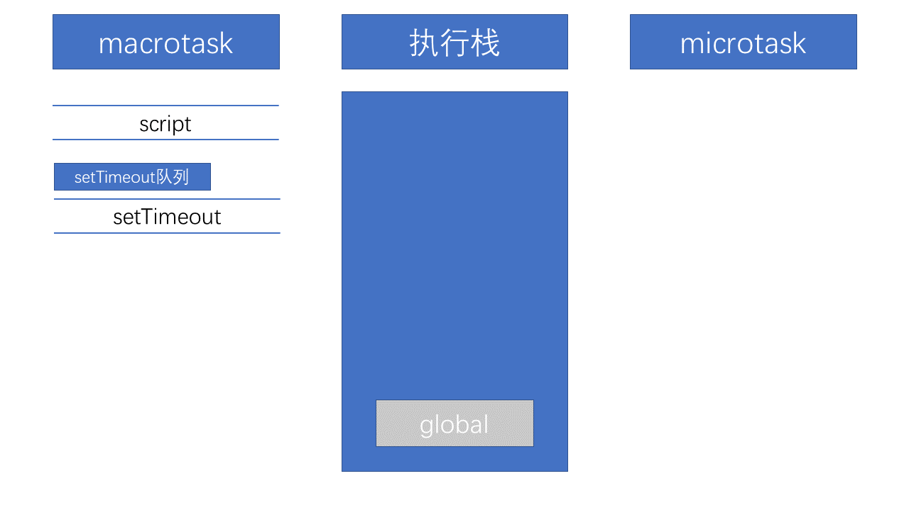
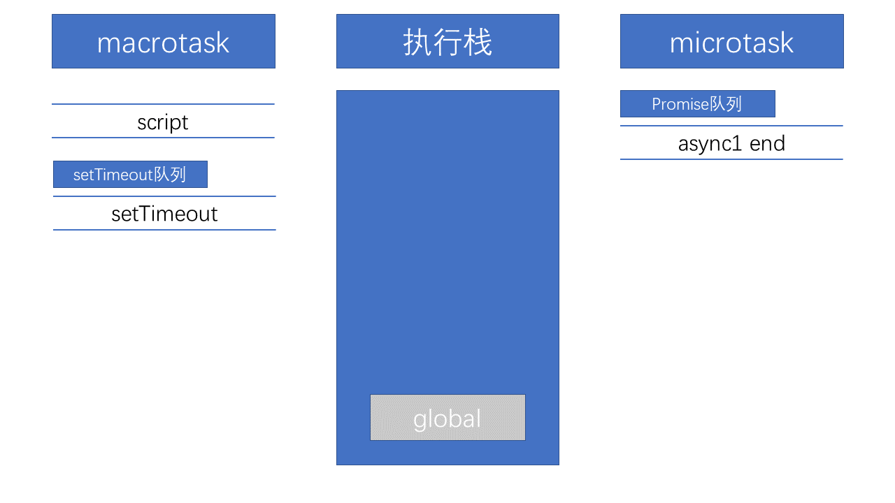
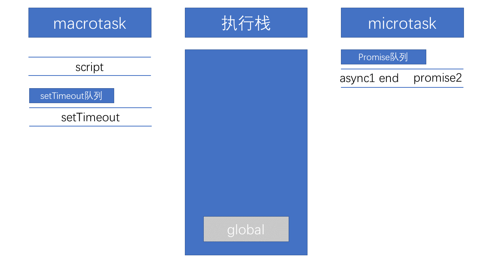

# 从一道题浅说 JavaScript 的事件循环

最近看到这样一道有关事件循环的前端面试题：

```js
// 请写出输出内容
async function async1() {
    console.log('async1 start');
    await async2();
    console.log('async1 end');
}
async function async2() {
    console.log('async2');
}

console.log('script start');

setTimeout(function() {
    console.log('setTimeout');
}, 0);

async1();

new Promise(function(resolve) {
    console.log('promise1');  
}).then(function(){
    console.log('promise2');
});
console.log('script end');

/*
script start
async1 start
async2
promise1
script end
async1 end
promise2
setTimeout
*/
```

这道题主要考察的是事件循环中函数执行顺序的问题，其中包括`async`、`await`、`setTimeout`、`Promise`函数。下面来说本题中涉及到的知识点。

## 任务队列

首先我们需要明白以下几件事情：
- JS分为同步任务和异步任务
- 同步任务都在主线程上执行，形成一个执行栈
- 主线程之外，事件触发线程管理着一个任务队列，只要异步任务有了运行结果，就在任务队列之中放置一个事件
- 一旦执行栈中的所有同步任务执行完毕（此时JS引擎空闲），系统就会读取任务队列，将可运行的异步任务添加到可执行栈中，开始执行

根据规范，事件循环（Event Loop）是通过**任务队列**的机制来进行协调的。一个 Event Loop 中，可以有一个或者多个任务队列（task queue），一个任务队列便是一系列有序任务（task）的集合；
**每个任务都有一个任务源（task source），源自同一个任务源的 task 必须放到同一个任务队列，从不同源来的则被添加到不同队列。** setTimeout / Promise 等 API 便是任务源，而进入任务队列是他们指定的具体任务。


## 宏任务

macrotask（宏任务），可以理解是每次执行栈执行的代码就是一个宏任务（包括每次从事件队列中获取一个事件回调并放到执行栈中执行）。

浏览器为了能够使得JS内部 macrotask 与 DOM 任务能够有序的执行，**会在一个 macrotask 执行结束后，在下一个 macrotask 执行开始前，对页面进行重新渲染，**流程如下：

```
macrotask -> 渲染 -> macrotask -> ...
```

macrotask 主要包含：script、setTimeout、setInterval、I/O、UI交互事件、postMessage、MessageChannel、setImmediate（Node.js 环境）。

## 微任务

microtask（微任务），**可以理解是在当前 task 执行结束后立即执行的任务。**也就是说，在当前 task 任务后，下一个 task 之前，在渲染之前。

所以它的响应速度相比 setTimeout（setTimeout 是 task）会更快，因为无需等待渲染。也就是说，在某一个 macrotask 执行完后，就会将它执行期间产生的所有 microtask 都执行完毕（在渲染前）。

microtask 主要包含：Promise.then、MutaionObserver、process.nextTick（Node.js 环境）。

## 运行机制

在事件循环中，每进行一次循环操作称为 tick，每一次 tick 的任务**处理模型**是比较复杂的，但关键步骤如下：

- 执行一个宏任务（栈中没有就从事件队列中获取）
- 执行过程中如果遇到微任务，就将它添加到微任务的任务队列中
- 宏任务执行完毕后，立即执行当前微任务队列中的所有微任务（依次执行）
- 当前宏任务执行完毕后，开始检查渲染，然后 GUI 线程接管渲染
- 渲染完毕后，JS线程继续接管，开始下一个宏任务（从事件队列中获取）

流程如下：


## Promise和async中的立即执行

我们知道 Promise 中的异步体现在`then`、`catch`中，所以写在 Promise 中的代码是被当做同步任务立即执行的。而在`async/await`中，在`await`出现之前，其中的代码也是立即执行的。那么出现了`await`的时候发生了什么呢？

## await做了什么

从字面意思上看 await 就是等待，await 等待的是一个表达式，这个表达式的返回值可以是一个 promise 对象也可以是其他的值。

很多人以为 await 会一直等待之后的表达式执行完之后才会继续执行后面的代码，**实际上 await 是一个出线程的标志。await 后面的表达式会先执行一遍，将 await 后面的代码加入到 microtask 中，然后就会跳出整个 async 函数来执行后面的代码。**

由于 async await 本省就是 promise + generator 的语法糖。所以 await 后面的代码是 microtask。所以对于本题中的
```js
async function async1() {
    console.log('async1 start');
    await async2();
    console.log('async1 end');
}
```
等价于
```js
async function async1() {
    console.log('async1 start');
    Promise.resolve(async2()).then(() => {
        console.log('async 1 end');
    });
}
```

## 回到本题

以上就本道题涉及到的所有相关知识点了，下面我们再回到这道题来一步步看看怎么回事。

1.  首先，事件循环从宏任务（macrotask）队列开始，这个时候，宏任务队列中，只有一个 script（整体代码）任务；
    当遇到任务源（task source）时，则会先分发任务到对应的任务队列中去。所以，上面例子的第一步执行如下图所示：
    

2.  然后我们看到了首先定义了两个`async`函数，接着往下看，然后遇到了`console`语句，直接输出`script start`。输出之后，script 任务继续往下执行，遇到`setTimeout`，作为一个宏任务源，则会先将其任务分发到对应的队列中：
    

3.  script 任务继续往下执行，执行了 async1() 函数，前面讲过 async 函数中在 await 之前的代码是立即执行的，所以会立即输出`async1 start`。
    遇到了 await 时，会将 await 后面的表达式执行一遍，所以紧接着输出`async2`，然后将 await 后面的代码也就是`console.log('async1 end')`加入到 microtask 中的 Promise 队列中，接着跳出 async1 函数来执行后面的代码。
    

4.  script 任务继续往下执行，遇到 Promise 实例。由于 Promise 中的函数是立即执行的，而后续的`.then`则会被分发到 microtask 的 Promise 队列中去。所以会先输出`promise`，然后执行`resolve`，将`promise2`分配到对应队列。
    

5.  script 任务继续往下执行，最后只有一句输出了`script end`，至此，全局任务就执行完毕了。

    根据上述，每次执行玩一个宏任务之后，回去检查是否存在 microtasks；如果有，则执行 microtasks 直到 microtask Queue 清空。

    因而在 script 任务执行完毕之后，开始查找清空微任务队列。此时，微任务中，Promise 队列有两个任务`async1 end`和`promise2`，因此按先后顺序输出`async1 end`, `promise2`，当所有的 microtasks 执行完毕之后，表示第一轮的循环就结束了。

6.  第二轮循环依旧从宏任务队列开始。此时宏任务中只有一个`setTimeout`，取出来直接输出即可，至此整个流程结束。


## 变式一

在第一个变式中我将 async2 中的函数也变成了 Promise 函数，代码如下：
```js
async function async1() {
    console.log('async1 start');
    await async2();
    console.log('async1 end');
}
async function async2() {
    // async2做出如下更改：
    new Promise(function(resolve) {
        console.log('promise1');
        resolve();
    }).then(function() {
        console.log('promise2');
    });
}
console.log('script start');

setTimeout(function() {
    console.log('setTimeout');
}, 0)
async1();

new Promise(function(resolve) {
    console.log('promise3');
    resolve();
}).then(function() {
    console.log('promise4');
});

console.log('script end');
```

可以先看看自己输入顺序会是什么，下面公布结果：
```
script start
async1 start
promise1
promise3
script end
promise2
async1 end
promise4
setTimeout
```

在第一次 macrotask 执行完之后，也就是输出`script end`之后，会去清理所有 microtask。所以会相继输出`promise1`,`async1 eng`,`promise4`，其余不再多说。

## 变式二

在第二个变式中，我们将 async1 中的 await 后面的代码和 async2 的代码都改为异步，代码如下：

```js
async function async1() {
    console.log('async1 start');
    await async2();
    // 更改如下
    setTimeout(function() {
        console.log('setTimeout1')
    }, 0);
}
async function async2() {
    // 更改如下
	setTimeout(function() {
		console.log('setTimeout2')
	}, 0);
}
console.log('script start');

setTimeout(function() {
    console.log('setTimeout3');
}, 0);
async1();

new Promise(function(resolve) {
    console.log('promise1');
    resolve();
}).then(function() {
    console.log('promise2');
});
```

可以先看看自己输出顺序会是什么，下面公布结果：
```
script start
async1 start
promise1
script end
promsie2
setTimeout3
setTimeout2
setTimeout1
```

在输出`promise2`之后，接下来会按照加入 setTimeout 队列的顺序来依次输出，通过代码我们可以看到加入顺序为`3 2 1`，所以会按 3， 2， 1 的顺序来输出。

## 变式三

变式三是在一篇面经中看到的原题，整体来说大同小异，代码如下：

```js
async function a1() {
    console.log('a1 start');
    await a2();
    console.log('a1 end');
}
async function a2() {
    console.log('a2');
}

console.log('script start');

setTimeout(() => {
    console.log('setTimeout');
}, 0);

Promise.resolve().then(() => {
    console.log('promise1');
});

a1();

let promise2 = new Promise((resolve) => {
    resolve('promise2.then');
    console.log('promise2');
});

promise2.then(res => {
    console.log(res);
    Promise.resolve().then(() => {
        console.log('promise2');
    });
});

console.log('script end');
```

无非是在微任务那块儿做文章，前面的内容如果你都看懂了的话这道题一定没问题的，结果如下：

```
script start
a1 start
a2
promise2
script end
promise1
a1 end
promise2.then
promise3
setTimeout
```

## See also

[第 10 期：异步笔试题](https://github.com/Advanced-Frontend/Daily-Interview-Question/blob/master/datum/summary.md#%E7%AC%AC-8-%E6%9C%9Fsettimeoutpromiseasyncawait-%E7%9A%84%E5%8C%BA%E5%88%AB)

[关于第10题的一些见解](https://github.com/Advanced-Frontend/Daily-Interview-Question/issues/7)

[从一道题浅说 JavaScript 的事件循环](https://github.com/dwqs/blog/issues/61)

[详解JavaScript中的Event Loop（事件循环）机制](https://zhuanlan.zhihu.com/p/33058983)

