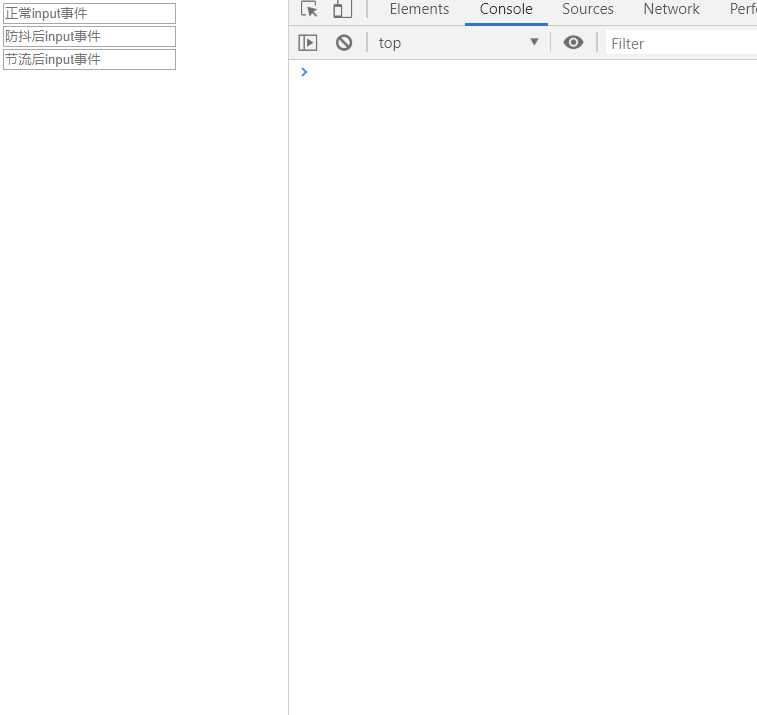
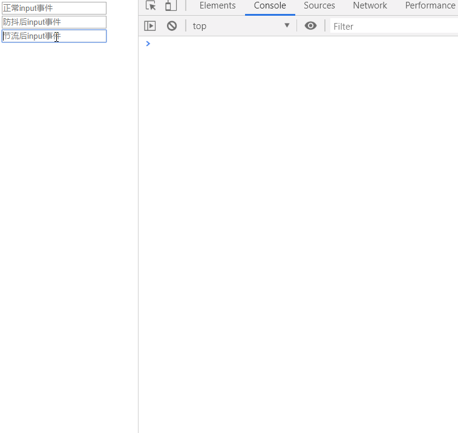

# 防抖&节流

防抖与节流都是日常开发经常用到的事件处理方式。
作用是为了防止某一时间频繁触发，但是两者是不同的。下面详细说明。

## 防抖（debounce）

> 防抖是指高频事件 n 秒只会执行一次，如果 n 秒内高频事件再次被触发，则重新计算时间。

看一下下图中的例子：



显而易见，每次输入后都会输出内容，而现实情况这样会很损耗资源、性能。

而我们使用防抖则会避免该类情况，下面代码：

```js
const debounceInput = document.querySelector('#debounceInput');

debounceInput.addEventListener('input', e => {
    debounceInstance(e);
});

function debounce(fn, delay) {
    return function(args) {
        let self = this;
        clearTimeout(fn.id);
        fn.id = setTimeout(() => {
            fn.call(self, args);
        }, delay);
    }
}

const debounceInstance = debounce(e => console.log(e.target.value, new Date().toString()), 500);
```


从控制台我们可以看到当你频繁输入时并不会执行，只有当你在指定间隔内没有输入时，才会执行函数。
如果停止输入但又在指定间隔内输入，则会重新触发计时。

## 节流（throttle）

> 规定一个单位时间内，只能触发一次。如果单位时间内高频触发，只有一次生效。

```js
const throttleInput = document.querySelector('#throttleInput');

throttleInput.addEventListener('input', e => {
    throttleInstance(e);
});

function throttle(fn, delay) {
    let last, timeId;
    return function(args) {
        let self = this;
        let now = new Date().getTime();

        if (last && now < last + delay) {
            clearTimeout(timeId);
            timeId = setTimeout(() => {
                last = now;
                fn.apply(self, arguments);
            }, delay);
        } else {
            last = now;
            fn.apply(self, arguments);
        }
    }
}

const throttleInstance = throttle(e => console.log(e.target.value, new Date().toString()), 1000);
```



可以看到，在我们不停输入时，方法会按照设定时间间隔 1s 执行一次。

## 应用场景

防抖（debounce）：
- 搜索时，用户不断输入，用防抖来节约资源
- window resize 时，不断调整窗口会一直执行，用防抖来提高性能。

节流（throttle）：
- 鼠标不断点击（mousedown），单位时间内只触发一次
- 滚动监听，eg: 监听到底加载更多功能

## 总结

防抖与节流都是为了防止函数多次调用。
区别在于：
- 防抖是指高频事件 n 秒只会执行一次，如果 n 秒内高频事件再次被触发，则重新计算时间。
- 节流是指高频事件触发，但 n 秒内只会执行一次，所以节流会稀释函数的执行频率。


## 参考资料

[7分钟理解JS的节流、防抖及使用场景](https://juejin.im/post/5b8de829f265da43623c4261#comment)

[节流和防抖](https://github.com/Advanced-Frontend/Daily-Interview-Question/issues/5)
